# 🌡️ Pune Hourly Temperature Forecast — Hybrid Stacking Ensemble

> A research-backed ML web application for hourly temperature prediction in Pune, India, using a Hybrid Stacking Ensemble of Residual DNN + XGBoost with Ridge meta-learner — achieving **Test R² = 0.9715** and **RMSE = 0.7908°C**.

[](https://python.org)
[](https://flask.palletsprojects.com)
[](https://tensorflow.org)
[](https://scikit-learn.org)
[](https://heroku.com)

---

## 📋 Table of Contents

- [Overview](#overview)
- [Research Paper](#research-paper)
- [Dataset & EDA](#dataset--eda)
- [Feature Engineering Pipeline](#feature-engineering-pipeline)
- [Model Architecture & Experiments](#model-architecture--experiments)
  - [Linear Regression — Baseline](#1-linear-regression--baseline)
  - [Random Forest — ML Benchmark](#2-random-forest--ml-benchmark)
  - [Residual DNN (Res-DNN)](#3-residual-dnn-res-dnn)
  - [Stacking A: DNN + RF → XGBoost (Experimental)](#4-stacking-a-dnn--rf--xgboost-experimental)
  - [Stacking B: DNN + XGBoost → Ridge (Proposed)](#5-stacking-b-dnn--xgboost--ridge-proposed)
- [Results Summary](#results-summary)
- [Project Structure](#project-structure)
- [API Reference](#api-reference)
- [Local Setup](#local-setup)
- [Tech Stack](#tech-stack)
- [Authors](#authors)

---

## Overview

Accurate short-term temperature forecasting is critical for urban agricultural planning and energy grid management in rapidly developing cities like Pune, India. Standard Global Circulation Models (GCMs) operate at coarse 25km grid resolutions, failing to capture the micro-climatic effects of Pune's unique topography — the leeward Sahyadri mountain range and aggressive urban heat island (UHI) dynamics.

This project addresses that gap through a **comparative ML study** followed by deployment of the winning model as a web API. The core insight is that **a regularized linear meta-learner (Ridge Regression) outperforms a complex non-linear meta-learner (XGBoost) in the stacking ensemble** — adding model complexity at the meta-layer causes overfitting, not improvement.

---

## Dataset & EDA

The dataset is a high-resolution **hourly meteorological dataset for Pune, India** (`weather_data.csv`), spanning 2009–2022 (~12 years). Input features include:

| Feature | Description |
|---|---|
| `DewPointC` | Dew point temperature (°C) |
| `humidity` | Relative humidity (%) |
| `cloudcover` | Cloud cover (%) |
| `uvIndex` | UV index (0–11) |
| `sunHour` | Sunshine hours per day |
| `precipMM` | Precipitation (mm) |
| `pressure` | Atmospheric pressure (hPa) |
| `windspeedKmph` | Wind speed (km/h) |
| `sunrise` / `sunset` | Solar event times |

### EDA Charts

**Year-wise Daily Average Temperature (2009–2022)**

Pune's temperature exhibits consistent seasonality with a clear UHI amplification trend visible in recent years.

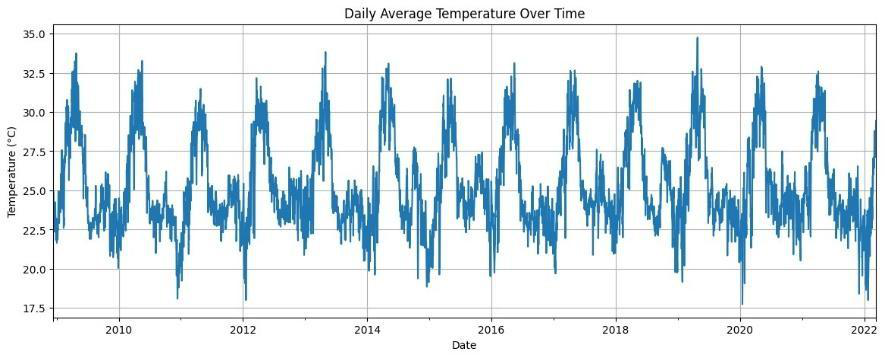

---

**Month-wise Average Temperature**

Peak temperatures in April–May (summer, ~30°C) drop sharply during the June–September monsoon and reach lows in December–January (winter, ~22°C).

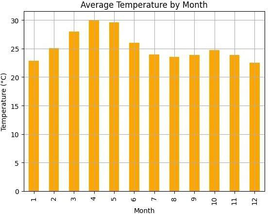

---

**Hourly Average Temperature — Diurnal Cycle**

Temperature bottoms out around 3 AM (~21°C) and peaks at 12–13 PM (~30.5°C), confirming a clean diurnal cycle with ~9°C swing — the primary signal the models must learn.

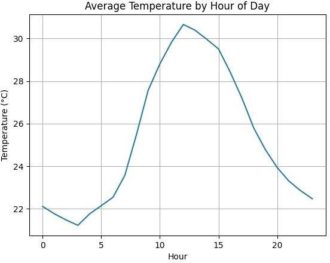

---

## Feature Engineering Pipeline

Raw meteorological data is processed through a **two-stage pipeline** implemented in `feature_engineer.py` as a scikit-learn `BaseEstimator + TransformerMixin` (so it integrates cleanly with `joblib`-serialized pipelines):

### Stage 1 — Feature Engineering (`FeatureEngineer`)

**Cyclic Temporal Encoding** — Standard integer encoding breaks continuity (Hour 23 is numerically far from Hour 0). Instead, `hour`, `day`, and `month` are projected onto a unit circle:

```
x_sin = sin(2π × x / P)
x_cos = cos(2π × x / P)
```

where P = 24 (hours), 31 (days), 12 (months). This lets the model learn continuous periodicity.

**Season Classification** — Categorical `season` variable:
- `winter` → Dec–Feb
- `summer` → Mar–May
- `monsoon` → Jun–Sep
- `post-monsoon` → Oct–Nov

**Precipitation Flag** — Binary `precip_flag` (1 if `precipMM > 0`) to tag rainfall-induced temperature drops.

**Solar Features** — `day_length_hours` (sunset − sunrise) and `day_progress` (normalized position within daylight hours), computed from sunrise/sunset strings.

### Stage 2 — Preprocessing (`ColumnTransformer`)

| Transform | Applied to | Reason |
|---|---|---|
| `QuantileTransformer` (→ Gaussian) | DewPoint, Humidity, CloudCover | Heavy-tailed / skewed distributions |
| `StandardScaler` | Pressure, WindSpeed, UV Index, SunHour | Prevents large-magnitude features from dominating loss |
| `OneHotEncoder` | Season | Orthogonal binary vectors for DNN and tree models |

**Pipeline Diagram:**

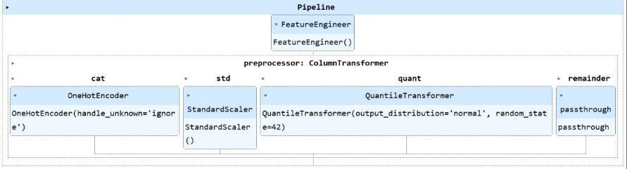

---

## Model Architecture & Experiments

Five architectures were evaluated to identify the optimal bias–variance tradeoff.

---

### 1. Linear Regression — Baseline

| Metric | Train | Test |
|---|---|---|
| RMSE | 1.8588 | 1.8752 |
| R² | 0.8404 | 0.8398 |
| MAE | — | 1.4883 |

**Diagnosis:** Severe underfitting. Linear models cannot capture the chaotic, non-linear interactions between humidity, wind speed, and temperature in Pune's micro-climate. The ~1.87°C RMSE is unacceptable for agricultural or grid-dispatch applications.

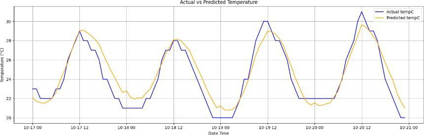

---

### 2. Random Forest — ML Benchmark

| Metric | Train | Test |
|---|---|---|
| RMSE | 0.3033 | 0.8138 |
| R² | 0.9958 | 0.9698 |
| MAE | — | 0.5927 |

**Diagnosis:** The training/test gap (Train R² = 0.9958 vs Test R² = 0.9698) exposes **overfitting** — the 100-tree ensemble memorizes noise in high-frequency time-series data rather than learning generalizable temporal patterns.

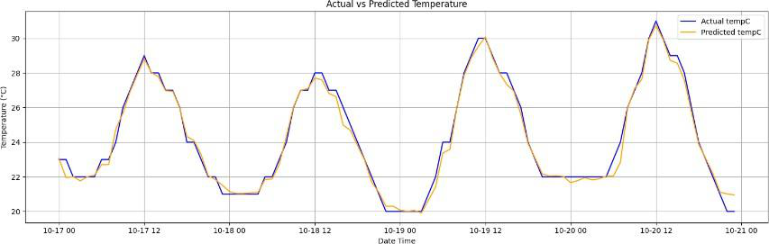

---

### 3. Residual DNN (Res-DNN)

| Metric | Train | Test |
|---|---|---|
| RMSE | 0.7409 | **0.7795** |
| R² | 0.9746 | **0.9723** |
| MAE | — | 0.5816 |

**Architecture:**

The key design decisions are **residual skip connections** (to prevent signal degradation in deep networks) and **GELU activation** (to smoothly capture rapid temperature transitions):

```
Input
  ↓
Dense(128, GELU) + L2 Regularization
  ↓
LayerNorm → Dropout(0.20)
  ↓
┌─────────────────────────┐
│  Dense(128, GELU)       │←── Skip Connection (bypass)
│  LayerNorm → Dropout    │
└─────────────────────────┘
  ↓
Dense(64, GELU) → LayerNorm → Dropout(0.15)
  ↓
Dense(32, GELU) → LayerNorm
  ↓
Output: Dense(1, linear)
```

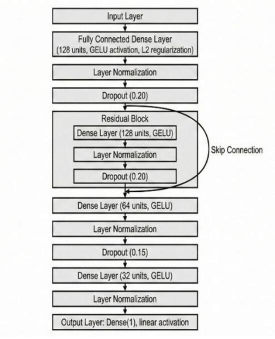

The small train/test gap (0.7409 vs 0.7795 RMSE) confirms that residual connections stabilize learning and prevent gradient degradation — giving the best **standalone** performance of all models.

---

### 4. Stacking A: DNN + RF → XGBoost (Experimental)

| Metric | Train | Test |
|---|---|---|
| RMSE | 0.2270 | 0.8267 |
| R² | 0.9976 | 0.9689 |

**Architecture:**

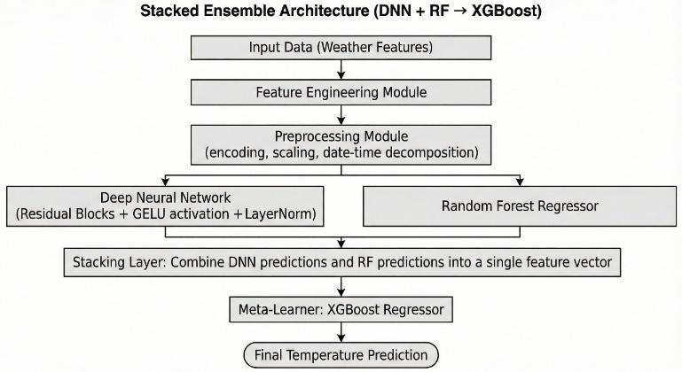

**Diagnosis: Severe overfitting.** Train R² = 0.9976 vs Test R² = 0.9689 — this is the worst generalization gap of all non-linear models. XGBoost as a meta-learner is powerful enough to memorize the noise patterns of the two base models' predictions, producing a stacking ensemble that performs *worse* than the standalone Res-DNN on test data.

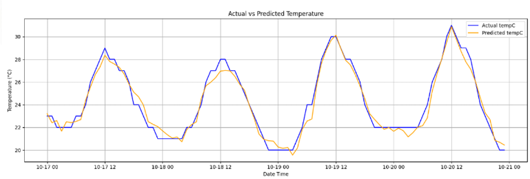

---

### 5. Stacking B: DNN + XGBoost → Ridge (Proposed)

| Metric | Train | Test |
|---|---|---|
| RMSE | 0.7542 | **0.7908** |
| R² | 0.9737 | **0.9715** |
| MAE | — | 0.5919 |

**Architecture:**

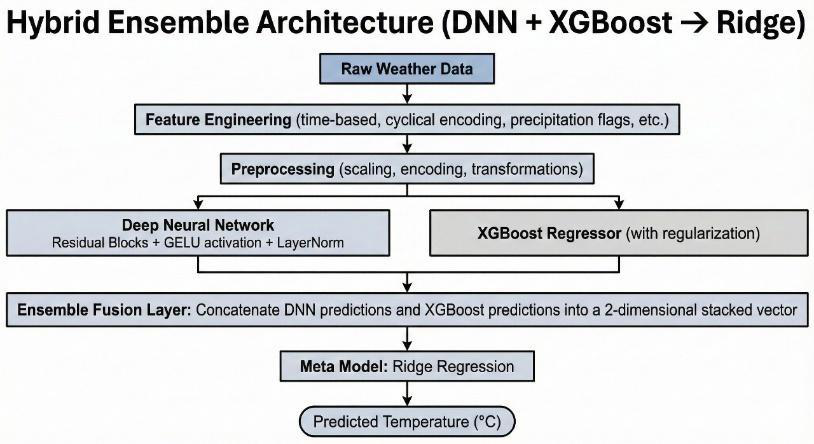

**Why this works:**

- **Base learner 1 (Res-DNN):** Captures temporal dynamics, diurnal cycles, and non-linear feature interactions
- **Base learner 2 (XGBoost):** Handles tabular meteorological features via gradient-boosted decision trees
- **Meta-learner (Ridge Regression):** Applies L2 regularization to penalize extreme weights, forcing the ensemble to find a **stable, smooth blend** of the two experts' outputs

Ridge cannot memorize noise — it can only learn a simple weighted combination. This is exactly what you want at the meta-layer: correct bias, not add variance.

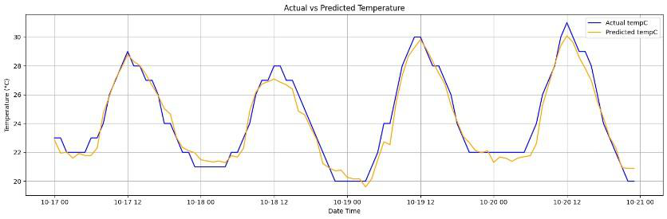

---

## Results Summary

| Model | Train RMSE | Test RMSE | Test MAE | Train R² | Test R² | Verdict |
|---|---|---|---|---|---|---|
| Linear Regression | 1.8588 | 1.8752 | 1.4883 | 0.8404 | 0.8398 | ❌ Underfitting |
| Random Forest | 0.3033 | 0.8138 | 0.5927 | 0.9958 | 0.9698 | ⚠️ Overfitting |
| Residual DNN | 0.7409 | 0.7795 | 0.5816 | 0.9746 | 0.9723 | ✅ Best Standalone |
| Stacking A (DNN+RF→XGB) | 0.2270 | 0.8267 | 0.5634 | 0.9976 | 0.9689 | ❌ Severe Overfitting |
| **Stacking B (DNN+XGB→Ridge)** | **0.7542** | **0.7908** | **0.5919** | **0.9737** | **0.9715** | **✅ Best Overall** |

**Key takeaway:** Complex meta-learners induce overfitting in stacking ensembles. A regularized linear meta-learner (Ridge) provides superior operational stability by preventing variance propagation from heterogeneous base models.

---

## Project Structure

```
Pune-Temperature-Forecast-Model-v2/
│
├── app.py                    # Flask API server
├── feature_engineer.py       # FeatureEngineer sklearn transformer
├── weather_data.csv          # Raw hourly meteorological dataset (2009–2022)
├── requirements.txt          # Python dependencies
├── Procfile                  # Gunicorn startup command (Heroku/Render)
├── runtime.txt               # Python runtime version
│
├── models/
│   ├── model.keras           # Trained Res-DNN (Keras format)
│   ├── preprocess.pkl        # Serialized sklearn Pipeline (FeatureEngineer + ColumnTransformer)
│   └── feature_metadata.json # Feature names and config
│
├── templates/
│   └── index.html            # Frontend UI (Jinja2 template)
│
└── static/
    ├── css/
    └── js/                   # Frontend scripts
```

---

## API Reference

### `POST /predict`

Accepts weather inputs for a given datetime and returns the predicted temperature.

**Request body (JSON):**

```json
{
  "date_time": "2024-06-15T14:30",
  "DewPointC": 18.5,
  "humidity": 65.0,
  "cloudcover": 30.0,
  "uvIndex": 7,
  "sunHour": 9.5,
  "precipMM": 0.0,
  "pressure": 1008.0,
  "windspeedKmph": 12.0,
  "sunrise": "06:05",
  "sunset": "19:15"
}
```

> `sunrise` / `sunset` are accepted in `HH:MM` (24h) format and converted internally to 12h AM/PM format before feature engineering.

**Response (JSON):**

```json
{
  "status": "success",
  "predicted_temperature": 29.74,
  "input_date": "2024-06-15 14:30:00"
}
```

**Error response:**

```json
{
  "error": "description of what went wrong"
}
```

---

## Local Setup

### Prerequisites

- Python 3.11
- pip

### Installation

```bash
# 1. Clone the repository
git clone https://github.com/Krishna-D17/Pune-Temperature-Forecast-Model-v2.git
cd Pune-Temperature-Forecast-Model-v2

# 2. Create and activate a virtual environment
python -m venv venv
source venv/bin/activate      # Linux/macOS
venv\Scripts\activate         # Windows

# 3. Install dependencies
pip install -r requirements.txt

# 4. Run the development server
python app.py
```

The app will be available at `http://localhost:5000`.

### Production (Gunicorn)

```bash
gunicorn app:app --bind 0.0.0.0:5000
```

### ⚠️ Known Issue: Pickle / `__main__` Fix

`FeatureEngineer` is a custom sklearn transformer serialized via `joblib`. When Flask loads it, pickle looks for the class in `__main__`, but the class lives in `feature_engineer.py`. The fix in `app.py`:

```python
from feature_engineer import FeatureEngineer
import __main__
__main__.FeatureEngineer = FeatureEngineer
```

This injects the class into `__main__`'s namespace before `joblib.load()` is called, resolving the `AttributeError` without retraining.

---

## Tech Stack

| Layer | Technology |
|---|---|
| Web Framework | Flask 3.0.0 + Flask-CORS |
| Deep Learning | TensorFlow/Keras 3.x (CPU) |
| ML / Feature Engineering | scikit-learn 1.7, XGBoost |
| Data Processing | pandas 2.2, NumPy 1.26 |
| Model Serialization | joblib (sklearn pipeline), `.keras` format |
| Production Server | Gunicorn |
| Frontend | HTML/CSS/JS (Jinja2 templates) |

---
